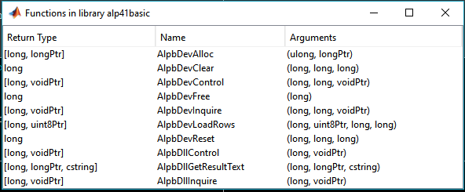
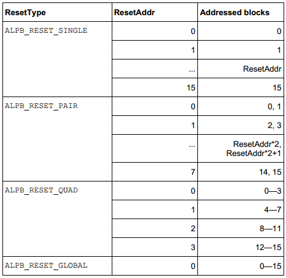

# API for controlling DMD

This API controls Digital Micromirror Devices (DMD) device controlled by ViALUX ALP controller. The library is provided by ViALUX GmbH, which is loaded into the environment. Since the library is in C++, there needs to be a working C++ compiler installed and setup with MATLAB. Compatible compilers could be found at [http://www.mathworks.com/support/compilers/R2014b/index.html](http://www.mathworks.com/support/compilers/R2014b/index.html) (careful about the version).

Necessary documentation and libraries can be found in accompanying media (CDs, Drives etc,) from ViALUX. Read about the original VIALUX API in documentation.

*   This API was developed with grateful aid from Dr. Martin Vogel (Max Planck Institute of Biophysics) and VIALUX. This is a simpler subset of the ALP Tool provided by Dr. Vogel. ([http://www.mathworks.com/matlabcentral/fileexchange/46673-alptool](http://www.mathworks.com/matlabcentral/fileexchange/46673-alptool))

*   Get ALP drivers at ([http://www.vialux.de/transfer/alp-4.2/ALP42_install.exe](http://www.vialux.de/transfer/alp-4.2/ALP42_install.exe) OR [http://www.vialux.de/transfer/alp-4.1/ALP41_install.exe](http://www.vialux.de/transfer/alp-4.1/ALP41_install.exe))

*   Careful about the versions of library you load - x64/ x86\. This API is for basic - not high speed.

*   Comments/ correspondence should be addressed to **nakulbende [at] gmail [dot] com**

*   Following functions can be used. An exmaple code with a typical routine is included as **_api_control.m_**. This code contains all the functions to be used, in the right order to load library, connect the mirrors and load images.

## Contents

*   [Load libraries in MATLAB _(api_library)_](#1)
*   [Connect/ Allocate a DMD device _(api_allocate)_](#3)
*   [Inquire device/ controller parameters _(api_inquire)_](#6)
*   [Reset the DMD device _(api_reset)_](#9)
*   [Clear the DMD mirrors _(api_clear)_](#12)
*   [Load image on the mirrors _(api_load)_](#15)
*   [Free the DMD Device after use _(api_free)_](#18)
*   [Return: Success / error reporting _(return_check)_](#21)

## Load libraries in MATLAB _(api_library)_

**Loads a shared library and it's functions in MATLAB environment.**

**INPUTS:** (both without file extensions)

_dll_name_ = name of the dll file

_dll_header_ = name of the header file

**OUTPUTS:**

_return_lib_ = 'Library is loaded'; or 'Error: Library was not loaded'

_(Opens a list of functions available in library in a seperate window)_

**Figure. 1 Loaded library and available functions**

<pre class="codeinput">function [return_lib] = api_library(dll_name, dll_header)
</pre>

## Connect/ Allocate a DMD device _(api_allocate)_

**Connects the device with MATLAB, and generates a device handle which will be used as an address for subsequent operations**

**INPUTS:** (both without file extensions)

_dll_name_ = name of the dll file

**OUTPUT:**

_hdevice_ = device handle generated by allocate function

<pre class="codeinput">function [return_allocate, hdevice] = api_allocate(dll_name)
</pre>

## Inquire device/ controller parameters _(api_inquire)_

**Sends a query to the device, and stores the value in an out pointer. The query types can be (found in documentation):**

**Table.1 Queries to be used in alp_inquiry, alp_control**

**INPUTS:**

_dll_name_ = Loaded control library _hdevice_ = device handle generated by allocate function

_query_ = Query type: Pg 6, returns in Pg. 7, Pg. 16, Pg. 17

**Common query commands (Pg. 16), non-exhaustive, please refer to documentation**

*   0: Timeout
*   1: dll Version, driver version
*   2\. Halt, firmware date
*   3\. Configuration date
*   4\. Device serial
*   5\. DMD Type (return values in Pg 7)
*   6\. Hardware version
*   7\. Chipset version
*   8\. DIP switches
*   9\. DDC Signals

**OUTPUT:**

_return_queryptr_ = C style pointer with the readout from device/ controlled about the specific query. Data type depends on the query, and can be found out by using the command get(_return_queryptr_)

<pre class="codeinput">function [return_inquiry, return_query] = api_inquire(dll_name, hdevice, query)
</pre>

## Reset the DMD device _(api_reset)_

**Reset the DMD device to load another image. _Should be performed before any clear function._ The reset operation itself takes the same time to finish, independent of how many mirrors are affected.**

**INPUTS:**

_dll_name_ = Loaded control library _hdevice_ = device handle generated by allocate function _reset_mode_ = first block to be cleared Pg. 22 of API guide,

*   1 : Single
*   2 : Pair
*   3 : Quad
*   4 : Global

_reset_address_ = address of block to be reset (0 for global), see guide for others

**Table.2 Reset block assignment for different options**

**OUTPUT:**

_return_reset_ = Return for success/ error reporting

<pre class="codeinput">function [return_reset] = api_reset(dll_name, hdevice, reset_mode, reset_address)
</pre>

## Clear the DMD mirrors _(api_clear)_

**The clear operation sets the memory content of whole reset blocks to logic ’0’**

**INPUTS:**

_dll_name_ = Loaded control library

_hdevice_ = device handle generated by allocate function

_first_block_ = first block to be cleared (0)

_last_block_ = last block to be cleared (15)

OUTPUT:

_return_clear_ = Return for success/ error reporting

<pre class="codeinput">function [return_clear] = api_clear(dll_name, hdevice, first_block, last_block)
</pre>

## Load image on the mirrors _(api_load)_

**Send an image to the mirrors, and display it. Careful about the lags, if using this in a loop. This should always be performaed in following to _Reset_ > _Clear_ command.**

**INPUTS:**

_dll_name_ = Loaded control library _hdevice_ = device handle generated by allocate function

_image_ = image matrix should be in 0/1\. Dimensions 768X1024 (rowsXcolumns). Note that C style structures are transpose equivalant of the MATLAB counterparts.

_first_row_ = first row to be loaded (0)

_last_row_ = last row to be loaded (767)

**OUTPUT:**

_return_load_ = Return for success/ error reporting

<pre class="codeinput">function [return_load] = api_load(dll_name, hdevice, image, first_row, last_row)
</pre>

## Free the DMD Device after use _(api_free)_

**Frees the device, and returns the mirrors to a floating position. !!Alwyas perform this beofre shutting off the mirrors!!**

**INPUTS:**

_dll_name_ = Loaded control library

_hdevice_ = device handle generated by allocate function

**OUTPUT:**

_return_free_ = Return for success/ error reporting

<pre class="codeinput">function [return_free] = api_free(dll_name, hdevice)
</pre>

## Return: Success / error reporting _(return_check)_

**Check the return from other functions - Check documentation (Pg. 9)**

**INPUTS:**

_return_value_ = Return for success/ error reporting

**OUTPUT:**

_out_signal_ = Return for success/ error reporting

**Table.3 Return codes**

<pre class="codeinput">function [out_signal] = return_check(return_value);
</pre>

[Published with MATLAB® R2014a](http://www.mathworks.com/products/matlab/)  

